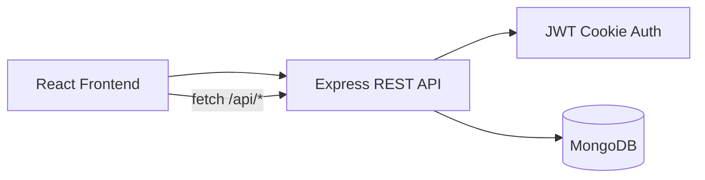

# 🎓 EduFlow – Academic Assignment Dashboard

**EduFlow** is a full-stack academic assignment platform built for modern academic environments. It enables seamless assignment distribution, tracking, and submission between professors and students with a focused Express + MongoDB backend, JWT auth, and a polished responsive UI.

**Live Demo:** https://eduflow-one-virid.vercel.app/


Demo :https://eduflow-one-virid.vercel.app/
---

### 🔑 Quick Demo Access

Skip the registration! Use the **Quick Demo Buttons** on the login page or use these credentials:
Live demo :https://eduflow-one-virid.vercel.app/

| Role | Email | Password |
| :--- | :--- | :--- |
| **Professor (Admin)** | `prof@joineazy.com` | `admin123` |
| **Student** | `riya@student.com` | `stu123` |

---

### ✨ Key Features

#### **👨‍🏫 Professor Privileges (Admin)**
- **Assignment Lifecycle:** Create and delete assignments with title, description, due date, and a Google Drive link.
- **Protected Admin Access:** JWT-based authentication and backend middleware keep admin routes server-side protected.
- **Class Analytics:** Instant stats on total students, pending tasks, and completion percentages with visual progress bars.

#### **👩‍🎓 Student Experience**
- **Smart Overview:** Visual summary cards showing total, completed, and pending assignment counts at a glance.
- **Progress Indicators:** Dynamic progress bars for individual assignment class progress and overall course completion.
- **Secure Submission:** A 2-step verification modal — "Yes, I have submitted" → final confirmation — prevents accidental submissions.

#### **💎 Premium Engineering**
- **Glassmorphism UI:** A sleek, professional **Slate & Blue** dark theme with backdrop blur and gradient accents.
- **Auth Features:** Password visibility toggle, JWT sessions, bcrypt password hashing, and protected backend routes.
- **Mobile First:** 100% responsive layout that works perfectly on phones, tablets, and desktops.
- **API Ready:** The backend is documented and can be exercised in Postman.

---

## 🏗️ Project Architecture

```
EduFlow/
│
├── index.html
├── package.json
├── vite.config.js
├── server/                            ← Express + MongoDB API
└── src/
    ├── App.jsx                        ← Root component; handles auth loading and routing
    ├── App.css                        ← App-level styles
    ├── main.jsx                       ← React DOM entry point
    ├── index.css                      ← Global resets and keyframe animations
    ├── context/
    │   └── AppContext.jsx             ← API-backed auth, assignments, and submission actions
    └── components/
        ├── Login.jsx                  ← Sign in form + quick demo access buttons
        ├── Navbar.jsx                 ← Top navigation with user info and logout
        ├── StudentDashboard.jsx       ← Student stats overview and assignment list
        ├── AdminDashboard.jsx         ← Admin stats, assignment management view
        ├── AssignmentCard.jsx         ← Shared card component (student & admin views)
        ├── ProgressBar.jsx            ← Reusable animated progress bar component
        ├── ConfirmSubmitModal.jsx     ← Step 1 of 2-step submission verification
        ├── SubmitConfirmModal.jsx     ← Step 2 final confirmation modal
        ├── CreateAssignmentModal.jsx  ← Admin form to create a new assignment
        └── Auth/
            ├── Register.jsx           ← New user registration with role selection
            └── ForgotPassword.jsx     ← Password recovery flow
```

---

## 🛠️ Tech Stack

| Layer | Technology |
| :--- | :--- |
| **Core** | React 19 (Vite) |
| **Styling** | Tailwind CSS |
| **State Management** | React Context API + `useState` / `useEffect` |
| **Backend** | Express + MongoDB + Mongoose |
| **Auth** | JWT sessions in httpOnly cookies + bcrypt hashing |
| **Deployment** | Vercel frontend + Render/Railway backend + MongoDB Atlas |

---

## 📦 Setup & Installation

### Prerequisites
- Node.js v18+
- npm or yarn
- MongoDB connection string

### Local Installation

```bash
# Clone the repository
git clone https://github.com/ChaudhariSwati/EduFlow.git

# Enter the directory
cd EduFlow

# Install frontend dependencies
npm install

# Install backend dependencies
cd server
npm install
cd ..

# Start the API server
npm run dev:server

# Start the frontend in another terminal
npm run dev
```

The frontend runs at `http://localhost:5173` and the API runs at `http://localhost:4000`.

### Environment Variables

Create a root `.env` for the frontend and a `server/.env` for the API:

```bash
VITE_API_URL=http://localhost:4000
```

```bash
PORT=4000
MONGODB_URI=mongodb://127.0.0.1:27017/eduflow
MONGODB_DB_NAME=eduflow
JWT_SECRET=replace-with-a-long-random-string
CLIENT_URL=http://localhost:5173
GOOGLE_CLIENT_ID=your-google-client-id.apps.googleusercontent.com
GEMINI_API_KEY=your-gemini-api-key
GEMINI_MODEL=gemini-1.5-flash
```

### Build for Production

```bash
npm run build
```

### Deploy to Vercel / Render

```bash
# Deploy the frontend with Vercel
vercel --prod

# Deploy the backend separately on Render or Railway using the server/ folder
```

---

## 🔌 API Routes

| Method | Route | Description |
| :--- | :--- | :--- |
| `POST` | `/api/auth/register` | Create a student or admin account and set the auth cookie |
| `POST` | `/api/auth/login` | Authenticate and set the auth cookie |
| `GET` | `/api/auth/me` | Return the current authenticated user |
| `POST` | `/api/auth/logout` | Clear the auth cookie |
| `POST` | `/api/auth/reset-password` | Update a password by email for the demo reset flow |
| `GET` | `/api/assignments` | Fetch assignments for the signed-in user |
| `POST` | `/api/assignments` | Create a new assignment as an admin |
| `DELETE` | `/api/assignments/:id` | Delete one of your own assignments |
| `POST` | `/api/submissions` | Mark an assignment as submitted |
| `GET` | `/api/students` | List students for admin dashboards |
| `POST` | `/api/ai/assignment-draft` | Generate assignment title/description with Gemini (admin only) |

Postman collection: [postman/EduFlow.postman_collection.json](postman/EduFlow.postman_collection.json)

---

## 🧩 Component Structure & Design Decisions

### `AppContext.jsx` — Single Source of Truth
All authentication and assignment data flow through a single React Context. Login state, assignment list, submission status, and all CRUD operations (create, delete, submit) are managed here. Components access state via the `useApp()` hook — no prop drilling anywhere in the tree.

### `Login.jsx` — Role-Based Entry Point
A single login form that routes users to their correct dashboard based on their `role` field (`student` or `admin`). Quick Demo buttons allow instant one-click access — useful for evaluators and demos without needing to type credentials.

### `AssignmentCard.jsx` — Dual-Role Shared Component
One card component handles both student and admin views. Students see their personal status badge (Done / Pending / Overdue) and a submit button. Admins see a per-student submission breakdown with color-coded status pills. This eliminates code duplication while keeping both experiences polished.

### `ProgressBar.jsx` — Reusable Progress Indicator
Extracted as its own component to keep dashboard files clean and allow consistent styling across student and admin views. Accepts a `value` prop (0–100) and animates smoothly with a CSS transition on mount.

### `ConfirmSubmitModal.jsx` + `SubmitConfirmModal.jsx` — 2-Step Verification Flow
The submission flow is split into two deliberate confirmation steps to match the double-verification requirement. Step 1 asks "Have you submitted?" and Step 2 asks for final confirmation before writing to global state and localStorage. This prevents accidental or premature submissions.

### `CreateAssignmentModal.jsx` — Admin Assignment Form
A controlled form with fields for title, description, Google Drive link, and due date. On submit, the new assignment is immediately injected into global state and persisted to `localStorage`. All enrolled students automatically start with `submitted: false` for the new assignment.

### `Auth/Register.jsx` — Role Selection on Signup
The registration flow includes a role selector (Student / Professor) so new users are correctly assigned from the start. This drives the entire role-based authorization logic downstream.

### Styling Philosophy
The UI uses a **dark glassmorphism theme** — semi-transparent cards with `backdrop-filter: blur`, a Slate & Blue color palette, gradient progress bars, and smooth hover micro-interactions. Tailwind CSS utility classes handle layout and spacing consistently across all screen sizes.

---

## 🔐 Authentication & Authorization

| Rule | Implementation |
| :--- | :--- |
| Students and admins use the same client shell | `AppContext` fetches `/api/auth/me` on load |
| Students cannot access admin routes | `requireRole('admin')` on the backend |
| Admins see all student submission statuses | `assignment.submissions` object per student |
| Admins manage only their own assignments | `createdBy` field validated before delete |
| Session persists across refresh | JWT stored in an httpOnly cookie |

---

## 🗂️ Data Flow



1. The frontend loads the current user from `/api/auth/me`.
2. The API signs and verifies JWT cookies, so auth state is not stored in localStorage.
3. Assignment and student data come from MongoDB through the REST routes.
4. The user's `role` field determines which dashboard renders and what actions are available.

---

## 📱 Responsive Design

The layout uses CSS Grid with `auto-fill` and `minmax()` for assignment cards, collapsing from a 2-column desktop grid to a single-column mobile layout automatically. The Navbar compresses gracefully on small screens and all modals are center-aligned with full-width action buttons on mobile.

---

**Developed with ❤️ by [Chaudhari Swati](https://github.com/ChaudhariSwati)**
